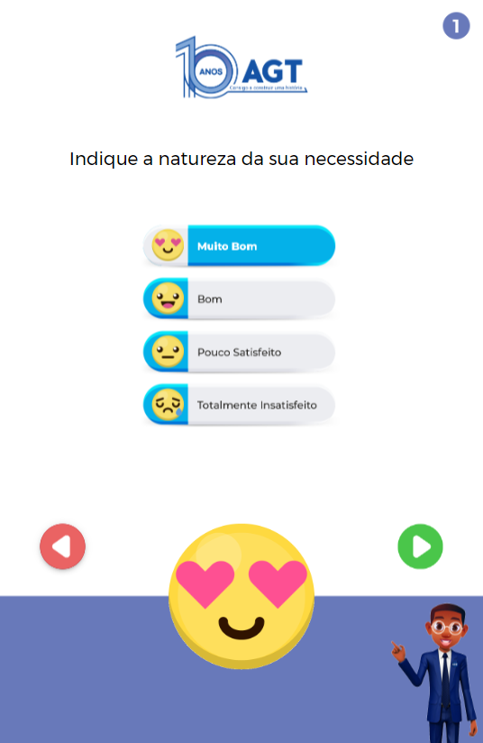
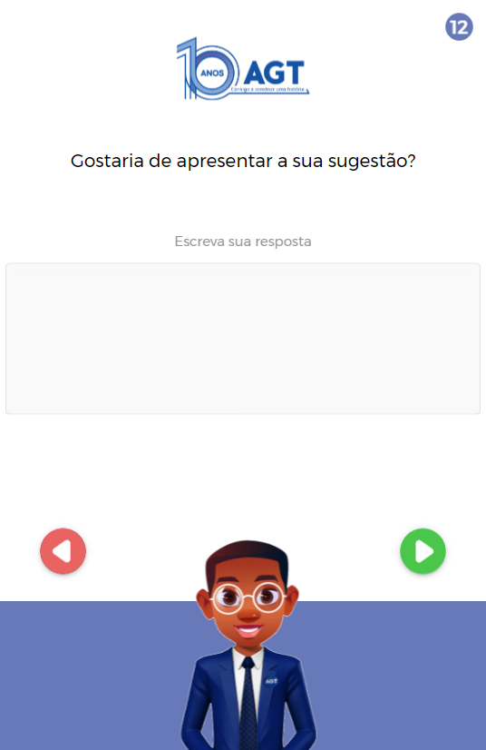

# Pesquisa de Satisfação


## Descrição
Este é um aplicativo de pesquisa de satisfação desenvolvido em Ionic. O aplicativo permite que os usuários avaliem a qualidade dos serviços ou produtos de uma empresa, fornecendo feedback valioso.

## Desenvolvedor
Este aplicativo foi desenvolvido por **Kaic Leonardo**.

- **Email:** [kaic.developer@gmail.com](mailto:kaic.developer@gmail.com)
- **GitHub:** [github.com/Kaic-Developer](https://github.com/Kaic-Developer)

## Funcionalidades
- **Avaliação de Qualidade:** Usuários podem avaliar serviços/produtos com diferentes níveis de satisfação.
- **Interface Intuitiva:** Interface amigável e fácil de usar.
- **Feedback Visual:** Imagens e animações que melhoram a experiência do usuário.

## Tecnologias Utilizadas
- **Framework:** Ionic
- **Linguagens:** HTML, CSS, TypeScript

## Capturas de Tela




## Instalação
Para instalar e executar o aplicativo localmente, siga os passos abaixo:

1. **Clone o repositório:**
   ```bash
   git clone https://github.com/Kaic-Developer/pesquisa-satisfacao.git
2. **Navegue até o diretório do projeto:**
   ```bash
   cd pesquisa-satisfacao
3. **Instale as dependências:**
   ```bash
   npm install
4. **Execute o aplicativo:**
   ```bash
   ionic serve

**Uso**
Após a instalação, abra o aplicativo no seu navegador através do endereço fornecido pelo comando ionic serve e siga as instruções na tela para realizar a pesquisa de satisfação.

**Contribuição**

Contribuições são bem-vindas! Se você quiser melhorar o aplicativo ou corrigir bugs, sinta-se à vontade para abrir uma issue ou enviar um pull request.

**Licença**
Este projeto está licenciado sob a Licença MIT.

**Contato**
Se você tiver alguma dúvida ou sugestão, entre em contato:

Email: kaic.developer@gmail.com
GitHub: github.com/Kaic-Developer
Desenvolvido com ❤️ por Kaic Leonardo


   

